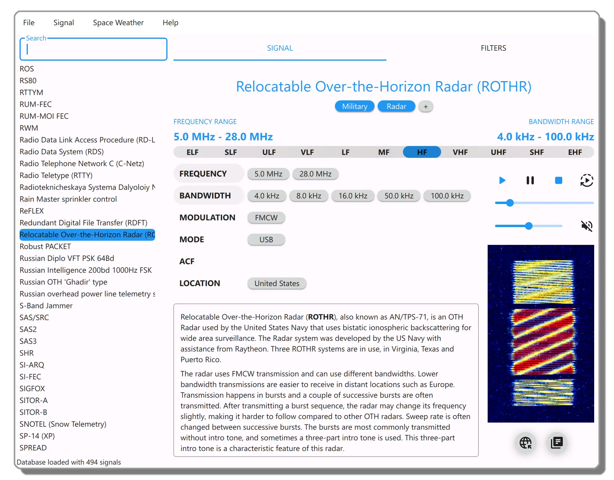

    

**Artemis** is a software designed to assist **radio frequency (RF) signal identification and storage**. It simplifies real-time spectrum analysis by leveraging one of the most extensive and community-driven databases, containing over **500 recognized signals**. This comprehensive software solution allows users to collect RF signals with specific parameters such as frequency, bandwidth, modulation, etc. Users can also store spectrum waterfalls, audio samples, and all types of documents for future reference. Artemis provides a robust platform to manage a wide range of RF data with precision and ease.

    

## Documentation
To learn more about Artemis go to the [complete documentation](https://AresValley.github.io/Artemis).

## Contributors
* **Marco Dalla Tiezza** - *Artemis I-II-IV developer, DB parsing, Website*
* [**Alessandro Ceccato**](https://github.com/alessandro90 "GitHub profile") - *Artemis III lead developer*
* **Paolo Romani (IZ1MLL)** - *Lead β Tester, RF specialist*
* **Carl Colena** - *Sigidwiki admin, β Tester, Signals expert*
* [**Marco Bortoli**](https://github.com/marbort "GitHub profile") - *macOS deployment, β Tester*
* [**Eric Wiessner (KI7POL)**](https://github.com/WheezyE "GitHub profile") - *ARM port (Raspberry Pi3B+ and Pi4B)*
* [**Pierpaolo Pravatto**](https://github.com/ppravatto "GitHub profile") - *Wiki page, β Tester*
* [**Francesco Capostagno**](https://github.com/fcapostagno "GitHub profile"), **Luca**, **Pietro** - *β Tester*

## License
Artemis is licensed under the [**GPL-3**](https://github.com/AresValley/Artemis/blob/master/LICENSE) license. 
