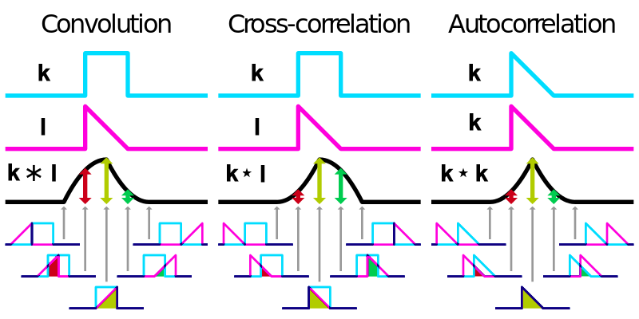
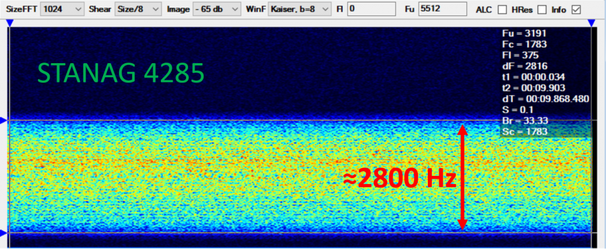
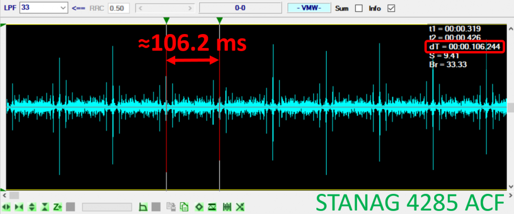
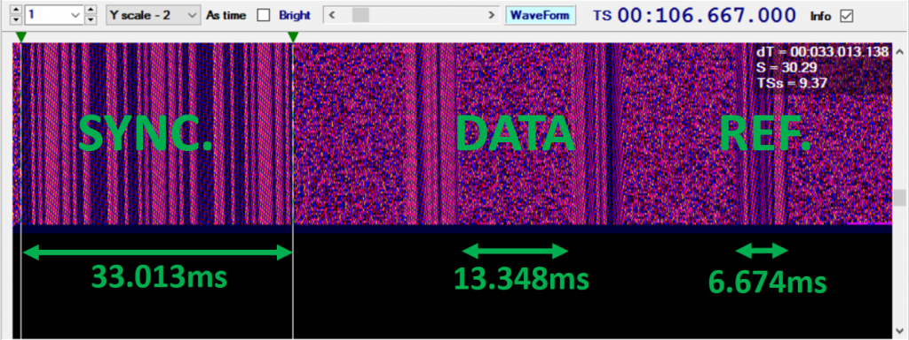

# Autocorrelation Function (ACF)

## Theoretical Introduction

Correlation functions are valuable mathematical tools utilized across various scientific disciplines, including engineering, physics, and chemistry. The cross-correlation function, commonly defined as a sliding inner (dot) product, quantifies the similarity between two signals as a function of a temporal shift applied to one of them:

$$
\left[ k*l \right]\equiv \int_{-\infty}^{+\infty}k^{*}(t)l(t+\tau)dt
$$

where $k$ and $l$ are two general non-discrete functions without discontinuity, $k^{*}$ is the complex conjugate of $k$ and $\tau$ is the lag (time delay for signal analysis). This representation is closely related to the convolution theorem by the following relationship:

$$
k(t)*l(t)\equiv k^{*}(-t)*l(t)
$$

In our case, the signal must be compared with itself to identify periodic patterns or detect anomalous high degrees of similarity within a given time interval. To achieve this objective, we can employ the Autocorrelation Function (ACF), which is essentially the cross-correlation of a signal with itself, where $k(t)=l(t)$. The following equation defines the ACF, derived from a straightforward modification of the initial equation:

$$
\left[ k*k \right](\tau)\equiv \int_{-\infty}^{+\infty}k^{*}(t)k(t+\tau)dt
$$

Within a discrete data set composed by $Y(t)$ records we can easily calculate autocorrelation from:

$$
\rho_{\tau}=\frac{\sum_{i=1}^{N-\tau}(Y_i-\bar{Y})(Y_{i+\tau}-\bar{Y})}{\sum_{i=1}^{N}(Y_i-\bar{Y})^2}
$$

where $Y_{i+τ}$ is a lagged data by $τ$ of $Y_i$ and $\bar{Y}$ is the average value of the original data set. Entire denominator is used to keep the normalization condition, indeed ρτ can assume a value between -1 (exact anticorrelation) and +1 (exact correlation). A complete correlation can be only achieved with a perfect overlap of the analyzed function with it self; the simple way to verify that is when $τ=0$

## Example: ACF Analysis
### STANAG 4285

The first example will be a NATO standard known as STANAG 4285. You can download a .wav sample from [:material-download: HERE](assets/stanag_4285.wav). 

    <audio controls>
        <source src="https://raw.githubusercontent.com/AresValley/Artemis/master/docs/assets/stanag_4285.wav" type="audio/wav">
        Your browser does not support the audio player.
    </audio>

We start to collect some information about the structure of this signal: a good starting point is the official declassified NATO document dated 1989. The main frame structure can be found at **Annex A-3/5** with a graphical view at **Annex A-7**, also reported below:

* [STANAG 4285 (i)](assets/acf_2.png)
* [STANAG 4285 A-3](assets/acf_3.png)
* [STANAG 4285 A-4](assets/acf_4.png)
* [STANAG 4285 A-5](assets/acf_5.png)
* [STANAG 4285 A-7](assets/acf_6.png)

!!! note "Summary"
    * 1 x 80 bits of synchronization pattern
    * 4 x 32 bits of data
    * 3 x 16 bits of reference

Therefore, a full sequence will be composed as the sum of all symbols reported above: 256 symbols recursively transmitted at the ratio of 2400 bauds means a redundancy of 106.66 ms.
To analyze an unknown signal I strongly recommend **Signal Analyzer (SA)**. SA is actually one of the most valuable and priceless software available by Sergey Makarov (Макаров Сергей Михайлович, sadly passed away on 29 May 2012) and it used to perform several tests on data sample coded as .wav or .mp3 file. The signal waterfall is reported below:

When an Autocorrelation function is applied on selected data frame (see above), the result shows a clear recursive pattern with a gap of **106.244 ms** between every peak as expected. An ACF refinement can be done into **WaveForm** windows where we can also notice an identical structure as reported by the specifications

!!! Success "Summary"
    1. Synchronization pattern is composed by $2400*33.013E-3=79.2\simeq 80$ symbols
    2. Data group contain $2400*13.348E-3=32.0=32$ symbols
    3. Reference sequence is formed by $2400*6.674E-3=16.02\simeq 16$ symbols