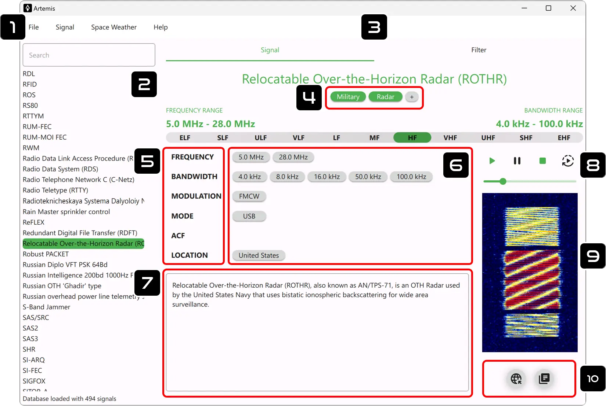

#

## 1. Main Menu

### File

* **New Database**

    Create a new database.

* **Load Database** 

    Open the Database Manager windows in order to open, rename, or delete a database.

* **Import Database** 

    Import an Artemis database with a standard .tar format.
    !!! tip "Offline Importing of SigID Database"
        Sometimes it may happen that a computer does not have network access and unfortunately Artemis cannot download the SigID database. To solve this you can:

        1. Download the .tar database [:material-download: HERE](https://github.com/AresValley/Artemis-DB/releases) from a PC with an internet access
        2. Import the downloaded .tar on the target PC (without internet access) using the **Import Database** function

* **Export Database** 

    Export the loaded database with a standard .tar format.

* **Edit Tags** 

    Open the tags editor window. From here, you can add, rename, or delete tags. The tags can be added to a signal from the [tags menu](#4-tags)

* **Open Database Folder**

    Shows the folder of the currently loaded database in the explorer.

* **Preferences**

    Open the program settings window.

* **Exit**

    This will close the application.

### Signal
* **New**

    Add a new signal to the database.

* **Edit**

    Edit the current/selected signal from the loaded database.

### Space Weather

* **Check Report**

    Open the main [Space Weather window](space_weather/current.md) and retrieve all the live data from Poseidon Crawler.

## 2. Signal List
This is the signal list where all the database entries are shown. When a signal is selected, it will load on the right panel.

### Filter by Name/Description
On top of the list, there is a field for filtering signals by name or any keyword inside the description of the signal: this filter has the highest priority among all the filters.

## 3. Signal Menu
Here you can swithc between the main **signal** window and the **filter** page.

## 4. Tags

* **Associate Tag**

    Custom tags can be associated to the selected signal with the :octicons-plus-circle-16: icon

* **Remove Tag**

    In order to remove a tag, just click on its badge.

* **Add/Rename Tag**

    To add a new tag open the [Tags Editor](#1-main-menu) in the main menu.

## 5. Add Parameter
Click on the labels to add the corresponding parameter to the signal (e.g. click on **Frequency** to add a new frequency).

## 6. Edit Parameter
Click on the parameter badge to open the Signal Editor windows. From here, you can edit or delete the corresponding parameter.

!!! tip "Parameter Description"
    All the parameters have a description field: if some text is added, it will appear when the corresponding parameter badge is hovered with the mouse pointer.

## 7. Description :simple-markdown:{ title="Markdown Supported" }
This is the description of the signal and can be edited from the [Main Menu](#1-main-menu) (`Signal/Edit...`)

!!! tip "Markdown Supported"
    The Description field can render **Markdown**, a simple markup language for creating rich text using plain text. Headers, emphasis, lists, links, code blocks, and many more features for advanced text formatting. [Markdown Basic Syntax :simple-markdown:](https://www.markdownguide.org/basic-syntax/)

## 8. Audio Sample
This is a player where an audio sample of the signal can be played. To associate an audio file to be shown as the **main** audio sample, check in the [extra menu](#10-extra) below the signal spectrum.

## 9. Image Sample
This is an image box that commonly contains the signal spectrum/waterfall. To associate an image file to be shown as the **main** image sample, check in the [extra menu](#10-extra) below the signal spectrum.

## 10. Extra

:material-earth: This button is only available for the standard SigID wiki database and connects the local signal to its counterpart on the [sigidwiki website](https://www.sigidwiki.com/).

:material-file-document-multiple: This will open the **Documents Manager**. From here you can add any file (audio, image, pdf, etc.) to the signal entry. It is also possible to mark only one image and one audio to be shown on the main signal window.
