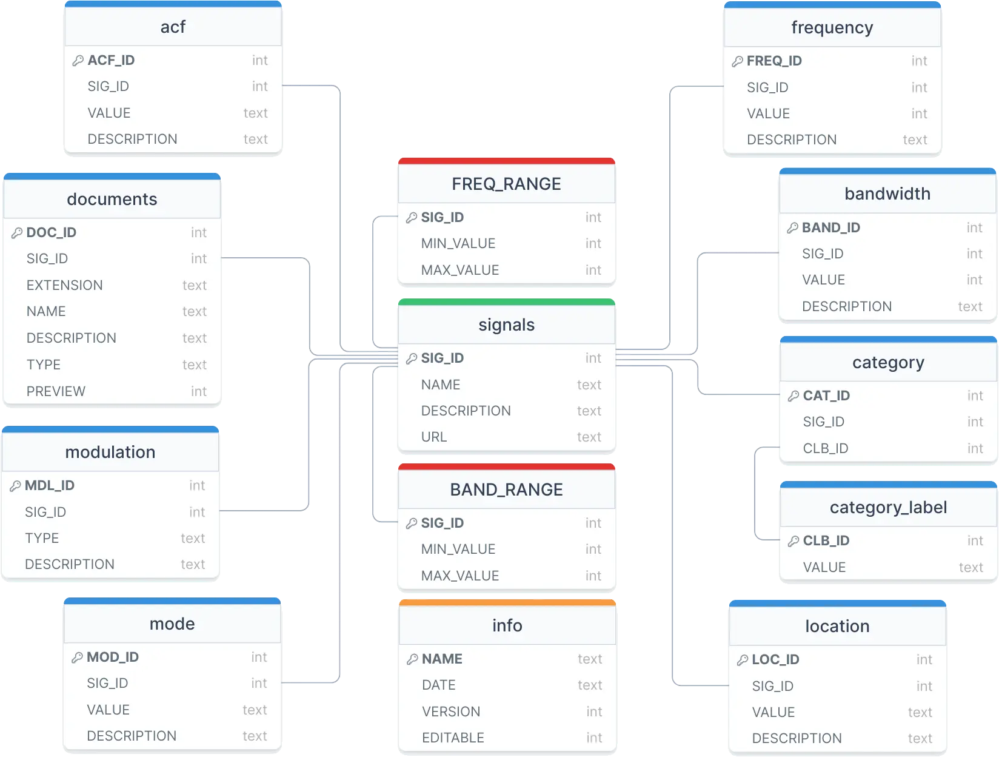

# Database

With the release of Artemis 4, we have made a significant upgrade in our data management system by transitioning from a CSV file to a full relational SQL database. This change brings a multitude of advantages that enhance the efficiency, scalability, and reliability of our system. In the following sections, we will explore, table by table, the structure of the new database.

