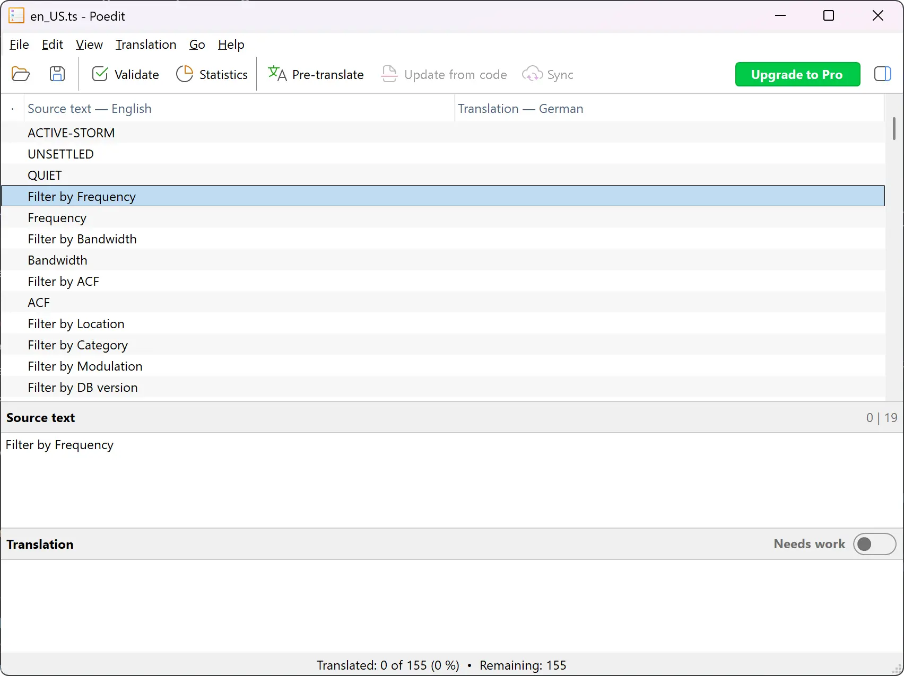

# Localization Guide

Thank you for your interest in making Artemis accessible to more people around the world! Contributing translations is one of the best ways to help the project grow.

Follow this step-by-step guide to translate Artemis into your language.

---

## 1. Get the Translation Template

1. Download the file named `en_US.ts` from [HERE](https://github.com/AresValley/Artemis/blob/master/artemis/i18n/en_US.ts).
2. Copy this file and use it as your starting template.
3. Rename the copied file to match your target language code (for example, `it_IT.ts` for Italian, `es_ES.ts` for Spanish, etc.).

## 2. Choose Your Tools

The `.ts` file is a standard XML-based layout that can technically be edited by hand with any text editor. However, it is highly recommended and much more convenient to use a free, dedicated translation tool like **Poedit**.

* You can download it for free at [poedit.net](https://poedit.com/).

## 3. Configure Your Target Language

1. Open your copied template file in Poedit.
2. Go to the top menu and select **Translation** -> **Properties**.
3. In the **Language of the translation** field, choose the language you want to translate Artemis into.
4. Click **OK** to save the properties.

## 4. Translate the Strings

1. You will see a list of phrases. Select a line from the list to translate it.
2. The **Source text** field displays the original phrase in English.
3. Type your translated version into the **Translation** text area below it.
4. Work your way through the list until all strings are translated.

## 5. Validate Your Work

1. Once you have finished translating, you can check your work using the built-in validation system.
2. Click the **Validate** button (or check for validation warnings) to ensure no strings were missed and that formatting tags remain correct.

## 6. Submit Your Translation

There are two ways you can send your completed translation file to us:

### Option A: Via Email (Simple)

Save your final `.ts` file and email it directly to us at: **artemis.info@gmail.com**

### Option B: Via GitHub Pull Request (Advanced)

If you prefer a standard developer workflow, you can make a classic **Pull Request** on our GitHub repository using the [contribute guidelines](https://github.com/AresValley/Artemis?tab=contributing-ov-file#contributing-to-artemis). Our team will review your changes and merge them accordingly.

---

*Thank you for helping us break language barriers and improve Artemis! If you have any questions, feel free to open an issue or reach out.*
