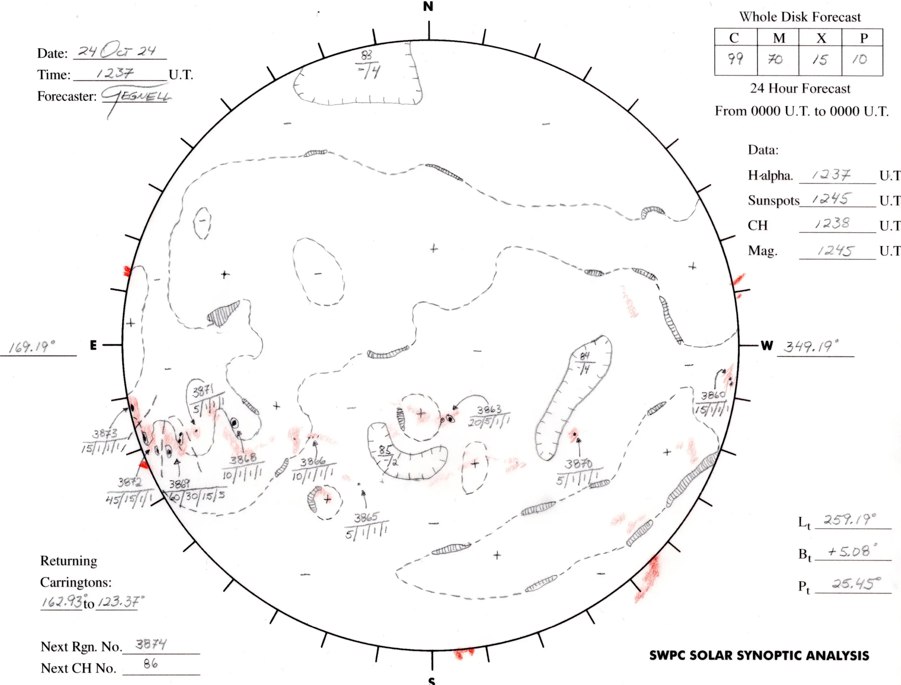

# Solar Synoptic Analysis
Synoptic maps of the solar surface are drawn each day by SWPC forecasters, providing forecasters with a broad outline of solar surface features. These maps were started on June 2, 1972 and have been produced daily since then.

!!! quote "Source"
    The Solar Synoptic Analysis is courtesy of the Space Weather Prediction Center (SWPC) part of the National Oceanic and Atmospheric Administration (NOAA), located in Boulder, Colorado.

## How to Read

### Active Regions
Active regions are localized magnetic fields on the Sun. Areas with strong or intense magnetic fields provide energy for solar flares and coronal mass ejections (CMEs), so accurate forecasting of space weather activity requires an accurate picture of these regions.
**Active regions are given official numbers by SWPC, and the drawings include the probabilities of C, M, and X class flares for the next 24 hours associated with each active region, along with a proton event probability.**

### Coronal Holes
Coronal holes are single polarity magnetic regions that are the source of high speed solar winds which drive magnetospheric activity. Coronal holes are the most common cause of geomagnetic storms. Coronal holes have historically been identified from He I 10830A ground-based observations. **The boundaries of coronal holes are shown on the synoptic drawings as lines with hash marks on the coronal hole side of the boundary line.**

### Neutral Lines
Large magnetic field structures of one magnetic polarity have a ‘neutral line’ at the boundary of the different magnetic polarities of the fields. Neutral lines are associated with flaring in active regions, and filaments/prominences are often associated with the neutral lines on a quiet sun. **Neutral lines appear as dashed lines on the synoptic drawings and the forecaster indicates the polarity of the magnetic field on either side of the neutral line with + (positive) and – (negative) signs.**

### Plages
Plages make up most of an Active Region, and appear bright in conjunction with the dark sunspots. Plages have strong magnetic fields but disorganized magnetic fields, unlike the highly organized fields of sunspots. **In the synoptic drawings, plages are colored red.** It is quite normal to have regions of plage with no sunspots, which do not receive an official number since they are not considered active regions and are unlikely to produce solar flares.

### Filaments and Prominences
Highly-stable regions of high density gas in the low density corona are called filaments. When these occur near the limb and can be seen protruding from the corona, often in spectacular fashion, they are called prominences. When they erupt they can be a geomagnetic storm threat, but the eruptions are usually slow and don’t often drive large storms. **The filaments and prominences are drawn as outlines with hash marks.**

## Solar Coordinates
- Lt: The current Carrington longitude line (north to south) at solar center disk.
- Bt: Referred to as the B-angle. The angle measured from the current position of Earth within its tilted (inclined) orbit, compared to the Sun’s equator. It ranges between + or – 7.23 degrees.
- Pt: Referred to as the position angle. Essentially, the current angle between Earth’s geocentric north pole and the Sun’s rotational north pole. The range is between + or – 26.31 degrees.
- Returning Carringtons: Refers to the next 3 days of returning Carrington longitude lines to the east limb of the Sun.

## Spot Group Labeling
Spot groups are labeled with their assigned NOAA SWPC number. Underneath that number are four probability numbers (from 1 to 100 %) for C-class flares, M-class flares, X-class flares, and energetic proton events.

## Coronal Hole Labeling
Coronal holes are labeled with their assigned number. Underneath that number is a plus or minus sign representing the polarity of the coronal hole. Beside that figure is a number from 1 to 4 representing confidence of coronal hole analysis (4=good; 3=fair; 2=poor; 1=uncertain).
