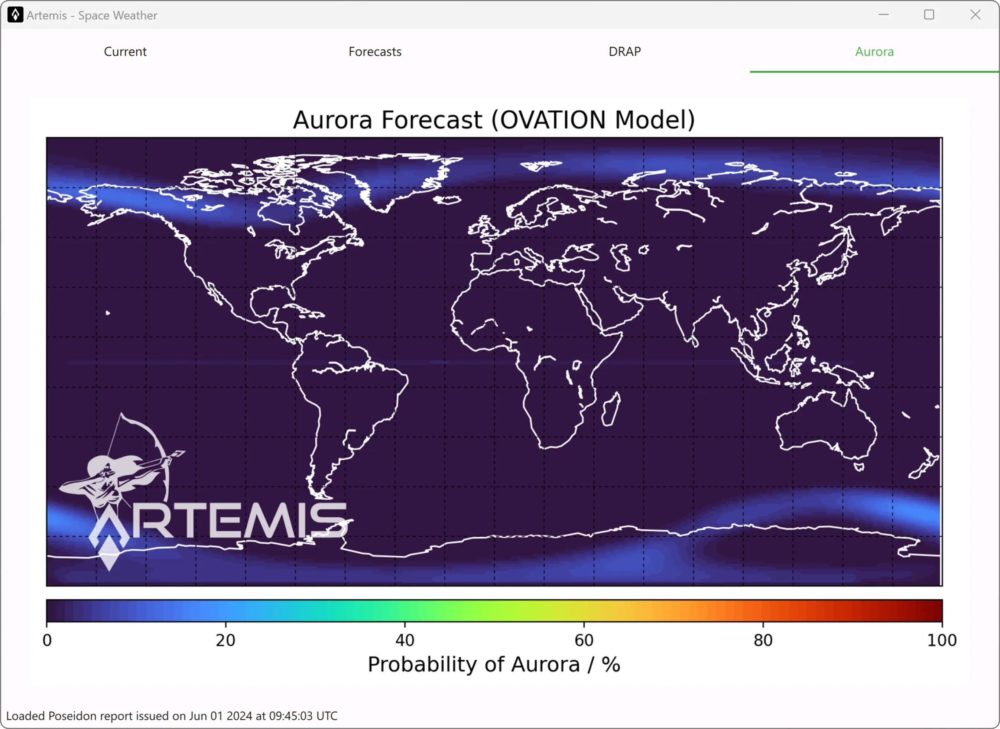

#

This short-term aurora forecast predicts its location and intensity over the next 30 to 90 minutes, based on the [OVATION model](https://www.swpc.noaa.gov/products/aurora-30-minute-forecast). The lead time of the forecast corresponds to the duration it takes for the solar wind to travel from the L1 observation point to Earth.

Auroras indicate current geomagnetic storm conditions and provide situational awareness for various technologies: for example, they directly affect HF radio communication and GPS/GNSS satellite navigation and are related to ground-induced currents impacting electric power transmission.

For many people, the aurora is a beautiful nighttime phenomenon that is worth traveling to arctic regions just to observe.  It is the only way for most people to actually experience space weather.
