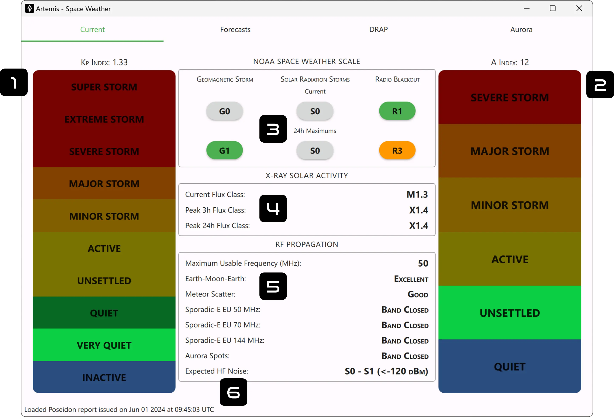

#

## 1. Kp Index
The **K index** is a number (from 0 to 9) that shows how much Earth's magnetic field is disturbed. A K index of 1 means things are calm, while a K index of 5 or higher indicates a geomagnetic storm. These disturbances are measured with magnetometers that track changes in Earth's magnetic field every three hours. The K itself comes from a German word "Kennziffer" meaning "characteristic digit". To get a big picture of what's happening around the world, an official planetary **Kp index** is calculated. This is done by averaging the K indices from a special network of 13 geomagnetic observatories located around the globe at mid-latitudes.

|Index|Activity Level|High Latitudes|Low Latitudes|Possible Source|
|-|-|-|-|-|
|**Kp 0**|Inactive|Weak & slow aurora possible|Aurora extremely unlikely|Small influx of particles due to some reconnections mostly at the magnetotail|
|**Kp 1**|Very Quiet|Weak & slow aurora likely|Aurora very unlikely|Vide supra|
|**Kp 2**|Quiet|Moderate auroral display|Aurora unlikely|Vide supra|
|**Kp 3**|Unsettled|Active auroral display, sporadic substorm possible|Weak aurora display possible|Coronal hole sending fast winds or remains after days of storming, enhanced solar wind|
|**Kp 4**|Active|Active auroral display, multiple sporadic substorms possible|Weak Aurora Display Possible|Vide supra|
|**Kp 5**|Minor Storm (G1)|Very active auroral display, multiple substorms likely|Aurora display likely|Coronal hole sending fast winds or coronal mass ejection (CME), enhanced solar wind|
|**Kp 6**|Moderate Storm (G2)|Strong auroral display, longer substorms|Active auroral display very likely|Vide supra|
|**Kp 7**|Strong Storm (G3)|Very strong auroral display|Strong auroral display extremely likely|Large CMEs caused by solar storms or flares, very enhanced solar wind with strong shock wave|
|**Kp 8**|Severe Storm (G4)|Extremely strong aurora, long periods of substorming|Strong auroral display extremely likely|Vide supra|
|**Kp 9**|Extreme Storm (G5)|Extremely strong aurora, long periods of substorming|Very strong auroral display, overhead aurora possible|Super CMEs, Carrington-class events, devastating solar wind with extreme shock waves|

## 2. A Index
The **A index** represents the three-hourly equivalent amplitude of geomagnetic activity at a specific magnetometer station, derived from the station-specific K index. Due to the quasi-logarithmic nature of the K-scale in relation to magnetometer fluctuations, directly averaging a set of K indices is not really meaningful. Instead each K is converted back into a linear scale. The **Ap index** is determined by averaging the eight daily A values, providing a measure of geomagnetic activity for a specific day. Days with higher levels of geomagnetic activity correspond to higher daily Ap values.

## 3. NOAA Space Weather Scale

### Geomagnetic Storm

??? danger "G5 (Extreme)"
    * **Physical measure:** Kp = 9
    * **Average Frequency:** 4 days per cycle (11 years)

    **Power systems:** Widespread voltage control problems and protective system problems can occur, some grid systems may experience complete collapse or blackouts. Transformers may experience damage.

    **Spacecraft operations:** May experience extensive surface charging, problems with orientation, uplink/downlink and tracking satellites.

    **Other systems:** Pipeline currents can reach hundreds of amps, HF (high frequency) radio propagation may be impossible in many areas for one to two days, satellite navigation may be degraded for days, low-frequency radio navigation can be out for hours, and aurora has been seen as low as Florida and southern Texas (typically 40° geomagnetic lat.).

??? danger "G4 (Severe)"
    * **Physical measure:** Kp = 8 to 9-
    * **Average Frequency:** 60 days per cycle (11 years)

    **Power systems:** Possible widespread voltage control problems and some protective systems will mistakenly trip out key assets from the grid.

    **Spacecraft operations:** May experience surface charging and tracking problems, corrections may be needed for orientation problems.

    **Other systems:** Induced pipeline currents affect preventive measures, HF radio propagation sporadic, satellite navigation degraded for hours, low-frequency radio navigation disrupted, and aurora has been seen as low as Alabama and northern California (typically 45° geomagnetic lat.).

??? warning "G3 (Strong)"
    * **Physical measure:** Kp = 7
    * **Average Frequency:** 130 days per cycle (11 years)

    **Power systems:** Voltage corrections may be required, false alarms triggered on some protection devices.

    **Spacecraft operations:** Surface charging may occur on satellite components, drag may increase on low-Earth-orbit satellites, and corrections may be needed for orientation problems.

    **Other systems:** Intermittent satellite navigation and low-frequency radio navigation problems may occur, HF radio may be intermittent, and aurora has been seen as low as Illinois and Oregon (typically 50° geomagnetic lat.).

??? warning "G2 (Moderate)"
    * **Physical measure:** Kp = 6
    * **Average Frequency:** 360 days per cycle (11 years)

    **Power systems:** High-latitude power systems may experience voltage alarms, long-duration storms may cause transformer damage.

    **Spacecraft operations:** Corrective actions to orientation may be required by ground control; possible changes in drag affect orbit predictions.

    **Other systems:** HF radio propagation can fade at higher latitudes, and aurora has been seen as low as New York and Idaho (typically 55° geomagnetic lat.).

??? info "G1 (Minor)"
    * **Physical measure:** Kp = 5
    * **Average Frequency:** 900 days per cycle (11 years)

    **Power systems:** Weak power grid fluctuations can occur.

    **Spacecraft operations:** Minor impact on satellite operations possible.

    **Other systems:** Migratory animals are affected at this and higher levels; aurora is commonly visible at high latitudes (northern Michigan and Maine).

### Solar Radiation Storms

??? danger "S5 (Extreme)"
    * **Physical measure:** Flux level of $\ge 10 MeV$ particles = $10^5$
    * **Average Frequency:** < 1 event per cycle (11 years)

    **Biological:** Unavoidable high radiation hazard to astronauts on EVA (extra-vehicular activity); passengers and crew in high-flying aircraft at high latitudes may be exposed to radiation risk.

    **Satellite operations:** Satellites may be rendered useless, memory impacts can cause loss of control, may cause serious noise in image data, star-trackers may be unable to locate sources; permanent damage to solar panels possible.

    **Other systems:** Complete blackout of HF (high frequency) communications possible through the polar regions, and position errors make navigation operations extremely difficult.

??? danger "S4 (Severe)"
    * **Physical measure:** Flux level of $\ge 10 MeV$ particles = $10^4$
    * **Average Frequency:** 3 events per cycle (11 years)

    **Biological:** Unavoidable radiation hazard to astronauts on EVA; passengers and crew in high-flying aircraft at high latitudes may be exposed to radiation risk.

    **Satellite operations:** May experience memory device problems and noise on imaging systems; star-tracker problems may cause orientation problems, and solar panel efficiency can be degraded.

    **Other systems:** Blackout of HF radio communications through the polar regions and increased navigation errors over several days are likely.

??? warning "S3 (Strong)"
    * **Physical measure:** Flux level of $\ge 10 MeV$ particles = $10^3$
    * **Average Frequency:** 10 events per cycle (11 years)

    **Biological:** Radiation hazard avoidance recommended for astronauts on EVA; passengers and crew in high-flying aircraft at high latitudes may be exposed to radiation risk.

    **Satellite operations:** Single-event upsets, noise in imaging systems, and slight reduction of efficiency in solar panel are likely.

    **Other systems:** Degraded HF radio propagation through the polar regions and navigation position errors likely.

??? warning "S2 (Moderate)"
    * **Physical measure:** Flux level of $\ge 10 MeV$ particles = $10^2$
    * **Average Frequency:** 25 events per cycle (11 years)

    **Biological:** Passengers and crew in high-flying aircraft at high latitudes may be exposed to elevated radiation risk.

    **Satellite operations:** Infrequent single-event upsets possible.

    **Other systems:** Small effects on HF propagation through the polar regions and navigation at polar cap locations possibly affected.

??? info "S1 (Minor)"
    * **Physical measure:** Flux level of $\ge 10 MeV$ particles = $10$
    * **Average Frequency:** 50 events per cycle (11 years)

    **Biological:** None.

    **Satellite operations:** None.

    **Other systems:** Minor impacts on HF radio in the polar regions.

### Radio Blackouts

??? danger "R5 (Extreme)"
    * **Physical measure:*** X20 ($2e^{-3} Wm^{-2}$)
    * **Average Frequency:** < 1 days per cycle (11 years)

    **HF Radio:** Complete HF (high frequency**) radio blackout on the entire sunlit side of the Earth lasting for a
    number of hours. This results in no HF radio contact with mariners and en route aviators in this sector.

    **Navigation:** Low-frequency navigation signals used by maritime and general aviation systems experience outages
    on the sunlit side of the Earth for many hours, causing loss in positioning. Increased satellite navigation errors in
    positioning for several hours on the sunlit side of Earth, which may spread into the night side. 

    *GOES X-ray peak brightness by class and by flux (measured in the 0.1-0.8 nm range, in W·m-2)

??? danger "R4 (Severe)"
    * **Physical measure:*** X10 ($10^{-3} Wm^{-2}$)
    * **Average Frequency:** 8 days per cycle (11 years)

    **HF Radio:** HF radio communication blackout on most of the sunlit side of Earth for one to two hours. HF radio
    contact lost during this time.

    **Navigation:** Outages of low-frequency navigation signals cause increased error in positioning for one to two
    hours. Minor disruptions of satellite navigation possible on the sunlit side of Earth.

    *GOES X-ray peak brightness by class and by flux (measured in the 0.1-0.8 nm range, in W·m-2)

??? warning "R3 (Strong)"
    * **Physical measure:*** X1 ($10^{-4} Wm^{-2}$)
    * **Average Frequency:** 140 days per cycle (11 years)

    **HF Radio:** Wide area blackout of HF radio communication, loss of radio contact for about an hour on sunlit side
    of Earth.

    **Navigation:** Low-frequency navigation signals degraded for about an hour. 

    *GOES X-ray peak brightness by class and by flux (measured in the 0.1-0.8 nm range, in W·m-2)

??? warning "R2 (Moderate)"
    * **Physical measure:*** M5 ($5e^{-5} Wm^{-2}$)
    * **Average Frequency:** 300 days per cycle (11 years)

    **HF Radio:** Limited blackout of HF radio communication on sunlit side of the Earth, loss of radio contact for tens
    of minutes.

    **Navigation:** Degradation of low-frequency navigation signals for tens of minutes. 

    *GOES X-ray peak brightness by class and by flux (measured in the 0.1-0.8 nm range, in W·m-2)

??? info "R1 (Minor)"
    * **Physical measure:*** M1 ($10^{-5} Wm^{-2}$)
    * **Average Frequency:** 950 days per cycle (11 years)

    **HF Radio:** Weak or minor degradation of HF radio communication on sunlit side of the Earth, occasional loss of
    radio contact.

    **Navigation:** Low-frequency navigation signals degraded for brief intervals. 

    *GOES X-ray peak brightness by class and by flux (measured in the 0.1-0.8 nm range, in W·m-2)

## 4. X-Ray Solar Activity
This is a summary of the **X-Ray Flare Class**. Large solar X-ray flares can change the Earth’s ionosphere, which blocks high-frequency (HF) radio transmissions on the sunlit side of the Earth. Solar flares are also associated with Coronal Mass Ejections (CMEs) which can ultimately lead to geomagnetic storms. SWPC sends out space weather alerts at the M5 level. Some large flares are accompanied by strong radio bursts that may interfere with other radio frequencies and cause problems for satellite communication and radio navigation (GPS).

| Class | Peak Strength (W/m2) | Effects on Earth                                             |
|-------|---------------------------------|--------------------------------------------------------------|
| B     | I < 10-6             | Too small to harm Earth                                      |
| C     | 10-6 ≤ I < 10-5 | Small with few noticeable consequences                 |
| M     | 10-5 ≤ I < 10-4 | Brief radio blackouts in polar regions, minor radiation storms |
| X     | I ≥ 10-4             | Planet-wide radio blackouts, long-lasting radiation storms |

## 5. RF Propagation

### Maximum Usable Frequency
In radio transmission, the maximum usable frequency (MUF) is the highest frequency that can be effectively used for communication between two locations on Earth by reflecting off the ionosphere (via skywave or skip) at a given time, regardless of the transmitter's power. This measurement is particularly valuable for shortwave transmissions.

### Earth-Moon-Earth
Earth–Moon–Earth communication (EME), commonly referred to as Moon bounce, is a radio communication method in which radio waves are transmitted from an Earth-based station, reflected off the Moon's surface, and then received back on Earth. The value gives the probability of a succesfull connection.

### Meteor Scatter
Meteor burst communications (MBC), also known as meteor scatter (MS) communications, is a radio propagation technique that uses the ionized trails created by meteors entering the atmosphere to establish brief communication links between radio stations up to 2,250 kilometers (1,400 miles) apart. This can involve either forward-scatter or back-scatter of the radio waves. Like EME, the value gives the probability of a succesfull connection.

### Sporadic-E
**Report of the latest E-skip spots on 50, 70 & 144 MHz by [DXrobot](https://dxrobot.gooddx.net/)**

Sporadic E (Es or SpE) is a rare type of radio propagation that uses a lower part of the Earth's ionosphere, which typically doesn't refract radio waves. It reflects signals off small "clouds" in the E region at altitudes of 95-150 km (50-100 miles). Unlike the regular F region skywave propagation, which depends on daily cycles of ionized layers from UV light, Sporadic E uses transient ionized patches. This allows for occasional long-distance VHF communication, usually during the six weeks around the summer solstice, beyond the normal line-of-sight range.

### Aurora Spots
**Report of the latest aurora spots on 50, 70 & 144 MHz by [DXrobot](https://dxrobot.gooddx.net/)**

Auroral propagation, or auroral backscatter, is a form of radio propagation that occurs during an auroral event, affecting VHF and UHF communications. Increased ionization in the E layer of the ionosphere reflects signals at much higher frequencies than usual, enabling communication up to 1000 MHz, though 500 MHz is more common. Signals are directed towards the auroral region and reflected back, but they are often distorted due to particle movement (the signal is roughly Doppler shifted of 1 kHz at around 150 MHz as the electrons stream down).

### Expected HF Noise
This is just the expected noise in HF based on the current Space Weather conditions.

## 6. Report Age
Poseidon Daemon is in charge of parse all the necessary data used for the Space Weather module. The data of the last generated report is written here.
