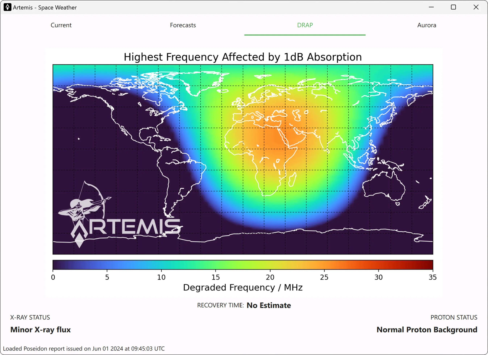

#

The D-Region Absorption Product (DRAP) evaluates the effects of solar X-ray flux and solar energetic particle (SEP) events on HF radio communication. Long-distance communications using high frequency (HF) radio waves (3 - 30 MHz) rely on signal reflection in the ionosphere. Typically, radio waves reflect near the peak of the F2 layer (~300 km altitude), but during their journey to and from this peak, the signals experience attenuation due to absorption by the intervening ionosphere.

The [D-Region Absorption Prediction model](https://www.swpc.noaa.gov/products/d-region-absorption-predictions-d-rap) provides guidance to understand the degradation and blackouts of HF radio communications that can result from these conditions.
