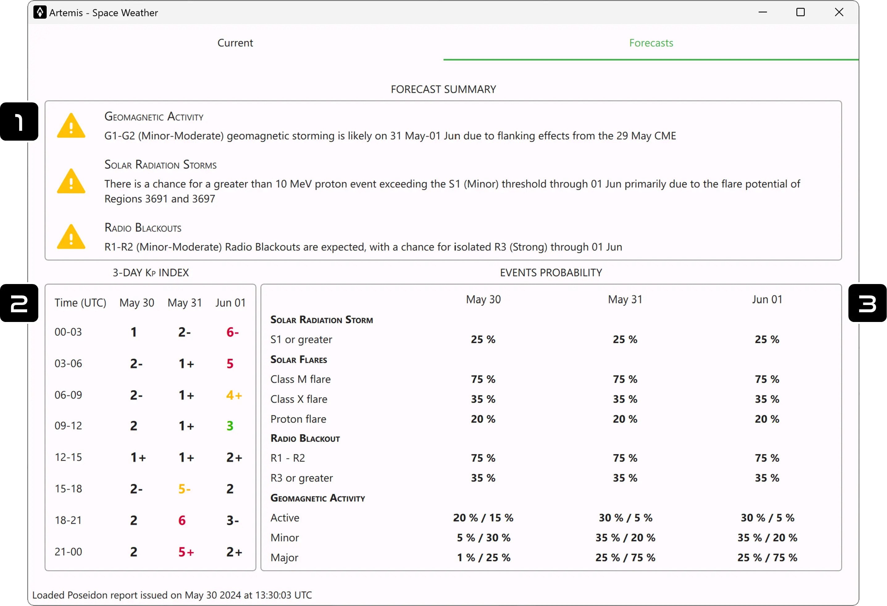

#

## 1. Forecast Summary
Geomagnetic activity, Solar Radiation Storms and Radio Blackouts probable events (in the next 3 days) are described in this section. 

## 2. 3-Day Kp Index
This is a 3 day projection of the [Kp index](current.md).

## 3. Events Probability
The probability (in percentage) of different events that can take place and generate some important conditions for RF propagation. All the event are explained [here](current.md).

!!! info
    Geomagnetic Activity has two percentual value per day: the left one refers to high-latitude location and the right one is for middle-latitude locations.
