# Sun Imagers

## Atmospheric Imagery Assembly
### 94 Å
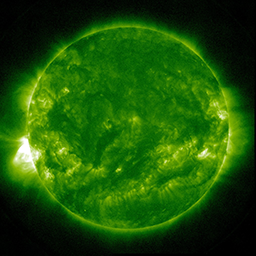

This channel (as well as AIA 131) is designed to study solar flares. It measures extremely hot temperatures around 6 million Kelvin (10.8 million F). It can take images every 2 seconds (instead of 10) in a reduced field of view in order to look at flares in more detail.

- **Where:** Flaring regions of the corona
- **Wavelength:** 94 angstroms (0.0000000094 m) = Extreme Ultraviolet/soft X-rays
- **Primary ions seen:** 17 times ionized iron (Fe XVIII)
- **Characteristic temperature:** 6 million K (10.8 million F)

### 131 Å
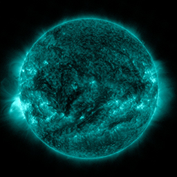

This channel (as well as AIA 094) is designed to study solar flares. It measures extremely hot temperatures around 10 million K (18 million F), as well as cool plasmas around 400,000 K (720,000 F). It can take images every 2 seconds (instead of 10) in a reduced field of view in order to look at flares in more detail.

- **Where:** Flaring regions of the corona
- **Wavelength:** 131 angstroms (0.0000000131 m) = Extreme Ultraviolet
- **Primary ions seen:** 20 and 7 times ionized iron (Fe VIII, Fe XXI)
- **Characteristic temperatures:** 10 million K (18 million F)

### 171 Å
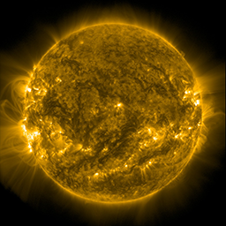

This channel is especially good at showing coronal loops - the arcs extending off of the Sun where plasma moves along magnetic field lines. The brightest spots seen here are locations where the magnetic field near the surface is exceptionally strong.

- **Where:** Quiet corona and upper transition region
- **Wavelength:** 171 angstroms (0.0000000171 m) = Extreme Ultraviolet
- **Primary ions seen:** 8 times ionized iron (Fe IX)
- **Characteristic temperature:** 1 million K (1.8 million F)

### 193 Å
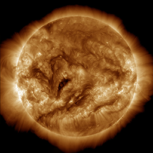

This channel highlights the outer atmosphere of the Sun - called the corona - as well as hot flare plasma. Hot active regions, solar flares, and coronal mass ejections will appear bright here. The dark areas - called coronal holes - are places where very little radiation is emitted, yet are the main source of solar wind particles.

- **Where:** Corona and hot flare plasma
- **Wavelength:** 193 angstroms (0.0000000193 m) = Extreme Ultraviolet
- **Primary ions seen:** 11 times ionized iron (Fe XII)
- **Characteristic temperature:** 1.25 million K (2.25 million F)

### 304 Å
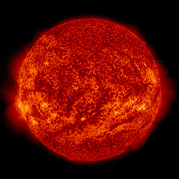

This channel is especially good at showing areas where cooler dense plumes of plasma (filaments and prominences) are located above the visible surface of the Sun. Many of these features either can't be seen or appear as dark lines in the other channels. The bright areas show places where the plasma has a high density.

- **Where:** Upper chromosphere and lower transition region
- **Wavelength:** 304 angstroms (0.0000000304 m) = Extreme Ultraviolet
- **Primary ions seen:** singly ionized helium (He II)
- **Characteristic temperature:** 50,000 K (90,000 F)

### 335 Å
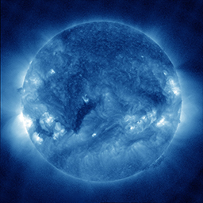

This channel (as well as AIA 211) highlights the active region of the outer atmosphere of the Sun - the corona. Active regions, solar flares, and coronal mass ejections will appear bright here. The dark areas - or coronal holes - are places where very little radiation is emitted, yet are the main source of solar wind particles.

- **Where:** Active regions of the corona
- **Wavelength:** 335 angstroms (0.0000000335 m) = Extreme Ultraviolet
- **Primary ions seen:** 15 times ionized iron (Fe XVI)
- **Characteristic temperature:** 2.8 million K (5 million F)

### 1600 Å
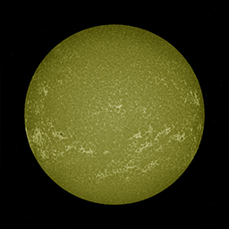

This channel (as well as AIA 1700) often shows a web-like pattern of bright areas that highlight places where bundles of magnetic fields lines are concentrated. However, small areas with a lot of field lines will appear black, usually near sunspots and active regions.

- **Where:** Transition region and upper photosphere
- **Wavelength:** 1600 angstroms (0.00000016 m) = Far Ultraviolet
- **Primary ions seen:** thrice ionized carbon (C IV) and Continuum
- **Characteristic temperatures:** 6,000 K (11,000 F), and 100,000 K (180,000 F)

### 1700 Å
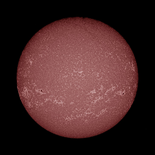

This channel (as well as AIA 1600) often shows a web-like pattern of bright areas that highlight places where bundles of magnetic fields lines are concentrated. However, small areas with a lot of field lines will appear black, usually near sunspots and active regions.

- **Where:** Temperature minimum and photosphere
- **Wavelength:** 1700 angstroms (0.00000017 m) = Far Ultraviolet
- **Primary ions seen:** Continuum
- **Characteristic temperature:** 6,000 K (11,000 F)

---
## Helioseismic and Magnetic Imager
### Magnetogram
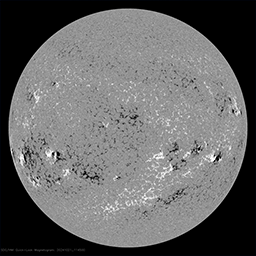

Magnetograms show maps of the magnetic field on the Sun’s surface. The HMI instrument uses the Zeeman effect to measure the intensity of the magnetic field component along the line of sight by making use of the circularly polarized spectral line. The color chart of the magnetic field along the line of sight is designed to visually show both high and low values. Intensities less than 24G are shades of gray. Positive values of the field are green and blue. Negative values are yellow and red. Regions with a weak field appear mainly in yellow or green. Progressively positive values range from dark green to light green (at 236 G). Negative values range from light yellow to orange (at -236G). There is a strong discontinuity in the coloration at 236G. Positive or negative sunspots and other regions with an intense field appear blue or red with dark umbrae. There are 254 colors arranged symmetrically around 0. The 127 positive values include 2 grays tending toward dark, 13 greens toward light, and 110 blues toward dark. The 127 negative values include 2 grays tending toward light, 18 yellows toward dark, and 107 reds toward dark. Nominally, each color indicates a range of about 11.81 G, and the coloration altogether spans the range between -1500 G and 1500 G

### Intensitygram
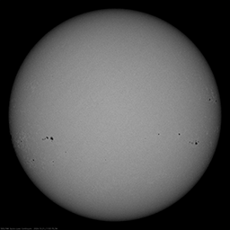

HMI samples the Fe I absorption line at 6173.3 Å at six points, assuming that the "pure" profile of the Fe I line is Gaussian and the transmission profiles are delta functions, the first and second Fourier coefficients of the Fe I line profile can be calculated, and Doppler velocity estimation can be performed. An estimate of the intensity in the continuum is obtained by "reconstructing" the solar line from the Doppler offset and the thickness and depth of the line.

### Dopplergram
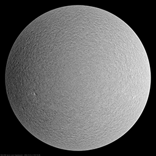

HMI camera 2 takes 72 images to construct a single Doppler diagram. Six images are taken at six positions across the spectral line at 6173.3 Å. Each image is taken in two polarization states, circularly polarized to the right (RCP or Stokes I-V) and circularly polarized to the left (LCP or Stokes I+V). Assuming that the absorption line is Gaussian and the transmission profiles of the HMI filter are delta functions, Fourier coefficients are calculated and then used to estimate the magnetic field B along the line of sight.

---
## Large Angle and Spectrometric Coronagraph
### LASCO C1 (NOT AVAILABLE)
A Fabry–Pérot interferometer coronagraph imaging from 1.1 to 3 solar radii, non-functional since the 24 June 1998 SOHO Mission Interruption

### LASCO C2 (orange)
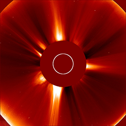

A white light coronagraph imaging from 1.5 to 6 solar radii. The LASCO camera is equipped with an occulting disk that blocks out the Sun to be able to study the faint details in the corona.

### LASCO C3 (blue)
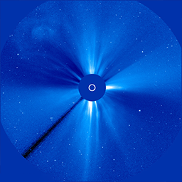

A white light coronagraph imaging from 3.7 to 30 solar radii
